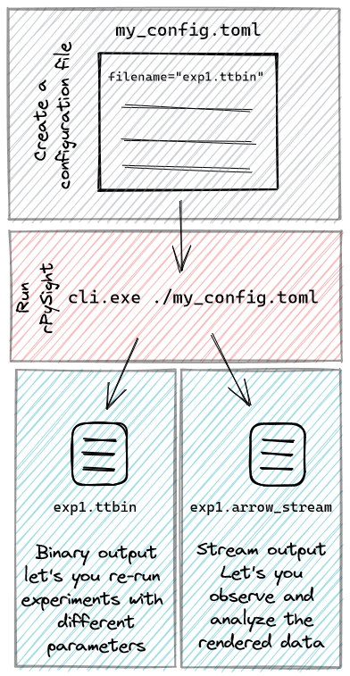

# Capturing and Visualizing Real-time Photon Counting 2D/3D Data --- A Tutorial

The protocol below describes how to use rPySight during a photon
counting experiment with and without a TAG lens, which provides a 3D
view of the imaged sample. 

## Preparations

The following procedures should be done on the computer that controls
the 2PM using dedicated software and hardware.

1.  Download rPySight from the [GitHub repository](https://github.com/PBLab/rpysight). You may install the
    binary from the "Releases" section (preferred) or download the
    source and compile it yourself. In the latter case you'll also need
    a Rust compiler which can be obtained from .

2.  Install the TT on your computer by following their [guide](https://www.swabianinstruments.com/static/documentation/TimeTagger/sections/gettingStarted.html). Make
    sure to follow the Python section to verify that you're able to
    communicate with the TT via its Python API.

3.  Download the `call_timetagger.py` file from the base repository and
    run it. It should succeed in importing the TimeTagger library, which
    indicates that the installation was successful.

4.  Set up the necessary environment variables. This is done by typing the
    following commands in a terminal:

    `$Env:PYTHONHOME = "<PATH-TO-FOLDER-WITH-python.exe>"`\
    `$Env:PYO3_PYTHON = "<PATH-TO-python.exe>"`

    Here's an example using a `conda` environment:

    `$Env:PYTHONHOME = "C:\Users\USERNAME\.conda\envs\timetagger\"`\
    `$Env:PYO3_PYTHON = "C:\Users\USERNAME\.conda\envs\timetagge\python.exe"`

    We hope to alleviate the need for this step in future versions.

4.  Run rPySight. Open a terminal and run rPySight by typing
    `<PATH-TO-EXE>\ cli.exe`. The process should hang indefinitely while
    rPySight waits for a line or frame signal that will start its
    rendering process. If the process immediately crashes then the
    installation procedure of either the TT or rPySight was
    unsuccessful. If the next two steps of this tutorial are working as
    intended please open an issue in rPySight's repository, else try to
    re-install the TT.

5.  Connect synchronization signals from the microscope's control boards
    to the TT's inputs. In a minimal experimental setup
    the required signals are a single photomultiplier tube (PMT),
    preferably after preamplification if the preamp is fast enough (at
    least 200 MHz), and the line synchronization signal, i.e. a cue that
    signifies that a new line has started. Other optional cables include
    a frame synchronization signal, the TAG lens synchronization pulses
    and more PMTs.

6.  If you've never inspected the signals emitted by your scanners and
    PMTs it might be better to first connect them to an oscilliscope to
    check their amplitude and polarity. A strong-enough signal may harm
    the TT, and a weak signal will not be detected reliably by the 50
    Ohm-terminated inputs.

7.  Configure the TT. Start the TT's native software and initialize the
    device. Access the settings menu (gray cogwheel) and set the active
    channels of the device based on the connections you've made in the
    previous step. Set the threshold value per channel to a value that's
    far enough from the base noise level.

8.  Test the incoming signals. Start the acquisition system to activate
    the synchronization signals and turn on the PMT to make sure that
    some photons are detected and preamplified before arriving to the
    TT.Next, start a TT measurement of type "Counter" for each connected
    channel. You should now see the two data streams on your screen.
    Assert that the event rate is as expected --- a resonant scanner
    should emit synchronization signals at its nominal frequency, while
    a PMT should emit photons at rates ranging from a few thousands of
    events per seconds to millions of them.

9.  If the event rates are at a sufficient pace turn off the measurement
    and disconnect the TT using the cogwheel menu. You're now ready to
    run rPySight.

10. rPySight cannot work while the TT is connected to the web UI. You
    must first shut down the TT from the settings menu before starting
    rPySight.

## General usage scheme

## Acquiring Data

1.  Prepare your setup for data acquisition. Turn on the laser, any
    auxiliary devices, and place the sample under the objective.

2.  Prepare the rPySight configuration file. You may use the pre-made
    file available in rPySight's repository and modify it to fit your
    setup:

    -   Change the input channels and thresholds to the values you set
        in the web-based user interface of the TT.

    -   Set the number of rows and columns of the image to match the
        values in your microscope acquisition software.

    -   If you have a TAG lens, make sure to enter its nominal frequency
        and set the number of planes to some value larger than one.

    -   Change the filename to make sure data is recorded to the
        expected folder.

3.  Run rPySight by issuing the command `cli.exe <PATH-TO-CONFIG.toml>`
    in your terminal. After a few seconds a blank window should pop up,
    and it will remain blank until the first line or frame signal is
    received.

4.  Start the other auxiliary devices, like the TAG lens or a behavioral
    camera.

5.  Start the acquisition and observe the rPySight window. Assuming that
    everything was set up correctly, you should see the two- or
    three-dimensional image on your display.

6.  Assert that data is being recorded to the folder you set in the
    configuration file. You should see a `.ttbin` file created by the TT
    and an `.arrow_stream` file that saves the coordinates of the
    displayed pixels.

## Data Inspection and Post Processing

The data which was collected and displayed by rPySight may be re-used
following the experiment in a few ways:

-   `.ttbin` files can be replayed using rPySight with different
    parameters, such as different averaging, more or less columns in the
    rendered image and with or without some of the data channels. To
    replay a file, the `filename` field in the configuration file should
    point to an existing file, and the `replay_existing` field should be
    set to `true`.

-   Re-running an experiment also overwrites the `.arrow_stream` file,
    so make sure to backup the previous one if you're satisfied with it.

-   rPySight's `.arrow_stream` files let you re-render the images or
    volumes in a rendering program of your choice. An example of such a
    feat can be found in rPySight's repository.
